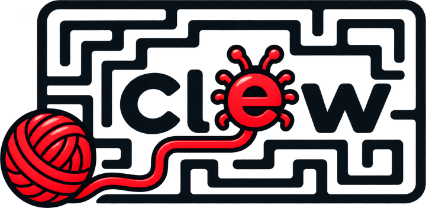

  <picture>
    <source media="(prefers-color-scheme: dark)" srcset=".github/clew-claro.png">
    
  </picture>

# Clew-Tests

Repositório de demonstração do **clew**: as issues daqui são abertas sozinhas pelo
rastreador do GitHub quando um erro dos ambientes DocFiscAll (lidos do OpenSearch)
passa do volume configurado, já com a leitura da IA no corpo.

| Label | Significado |
|---|---|
| `clew` | aberta automaticamente pelo clew |
| `nfe` · `nfce` · `nfse` | projeto de origem do erro |
| `nfse-nacional` | erro ligado ao padrão nacional da NFS-e |
| `api` · `worker` | tipo de ambiente que gerou o erro |
| `bug` | falha de código |
| `instabilidade` | falha de infraestrutura/dependência (timeout, 5xx, SEFAZ fora) |
| `regressao` | voltou depois de corrigido |
| `analisado-por-ia` | o corpo traz a análise da IA |
| `prioridade-alta` | volume alto ou impacto amplo em clientes |
